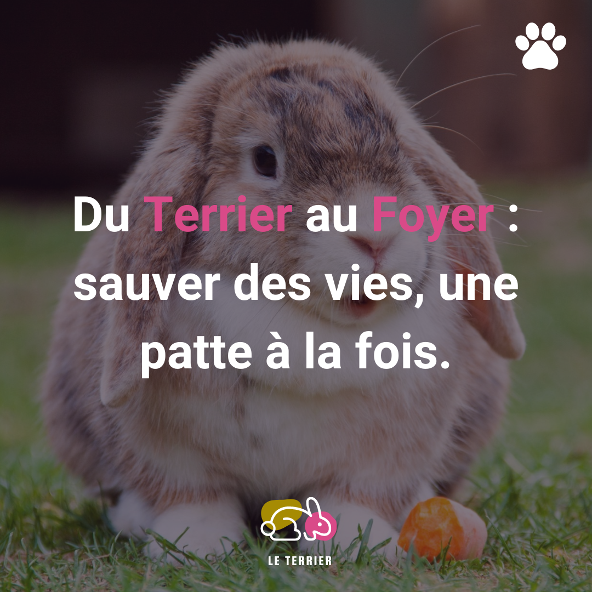

<h1 align="center"> 🐇 Bienvenue sur le site du Terrier ! 🐇 </h1>
<p align="center">

</p>
<br>

# 📄 A propos :

Le Terrier est une association dédiée à la protection et au bien-être des lapins abandonnés et maltraités. Notre mission est de recueillir, soigner et trouver des foyers aimants pour ces petits animaux souvent méconnus. Nous croyons fermement que chaque lapin mérite une chance de vivre heureux et en sécurité.


<p align="center"> 🐾 Grâce à l'engagement de nos bénévoles et au soutien de notre communauté, nous offrons une seconde chance à de nombreux lapins chaque année. 🐾 </p>

# 👩🏽‍💻 Découvrez le site :

Site pas encore déployé - Mignonnitude en chargement ... 🎀


# 💻 Stack Technique:


## 👨‍🔧 Installation

```sh
npm install
```
Création du fichier d'environnement 📁


# ©️ Credits :

Le Terrier est un site prototype réalisé en 48 heures dans le cadre de ma formation à la Wild Code School. Inspiré de vrais sites comme celui de la [Maison de Locky](https://la-maison-de-locky.assoconnect.com/page/1439263-accueil), une association de ma région, j'ai créé ce projet pour mettre en pratique mes compétences en développement web et valoriser l'engagement des bénévoles et associations de protection des animaux.

J'adresse également mes remerciements à mes instructeurs et mentors ([Anthony Gorski](https://fr.linkedin.com/in/anthony-gorski) and [Samuel Faber](https://www.linkedin.com/in/samuelfaberdev/)) de la Wild Code School pour leurs précieux conseils et leur soutien tout au long de ma formation.

<br>
<br>
<br>
<br>
